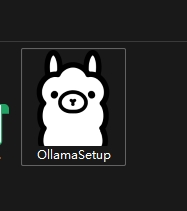
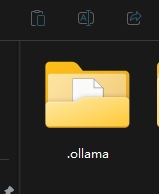
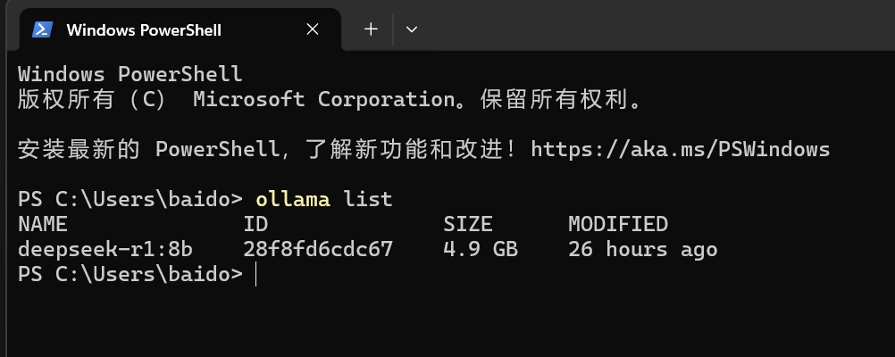
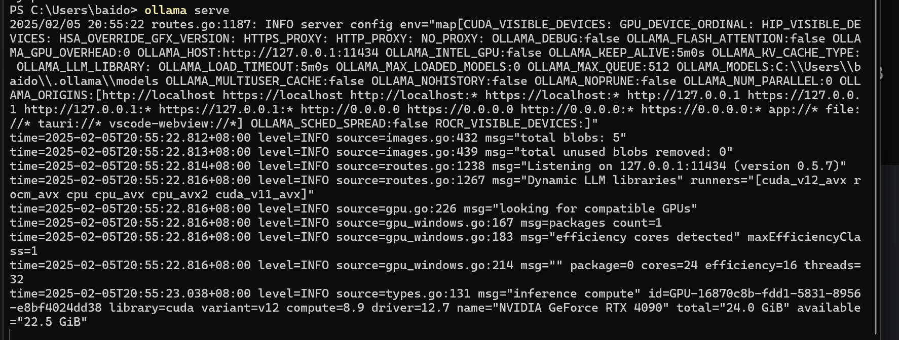
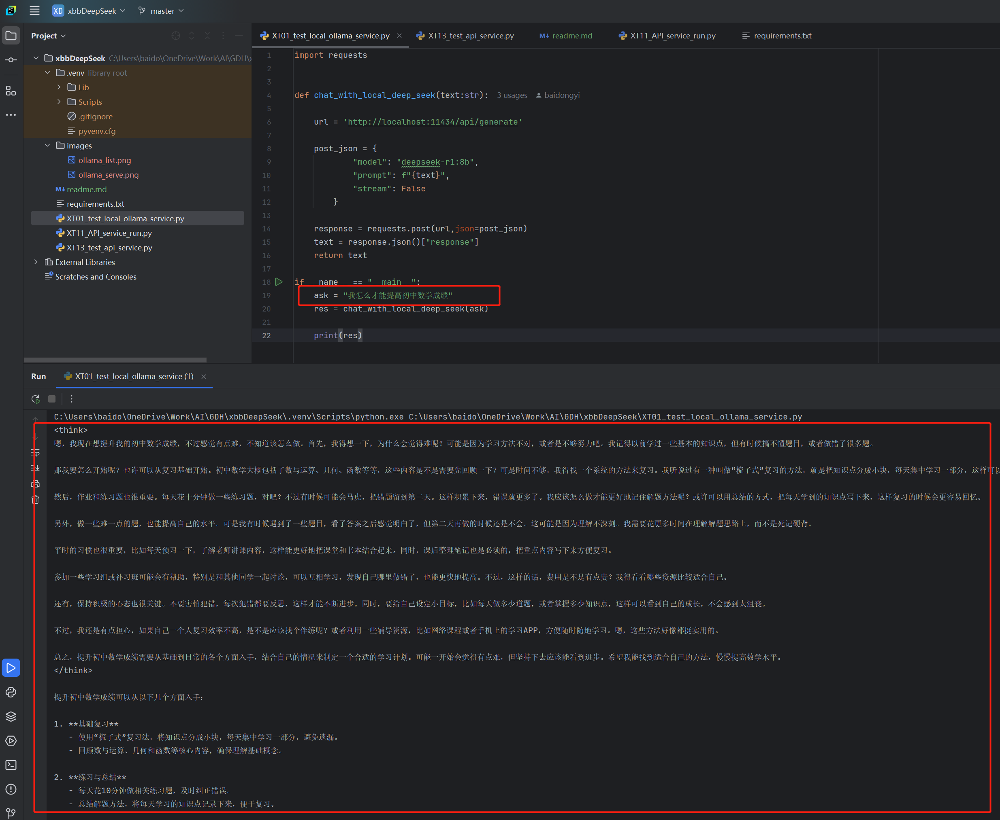
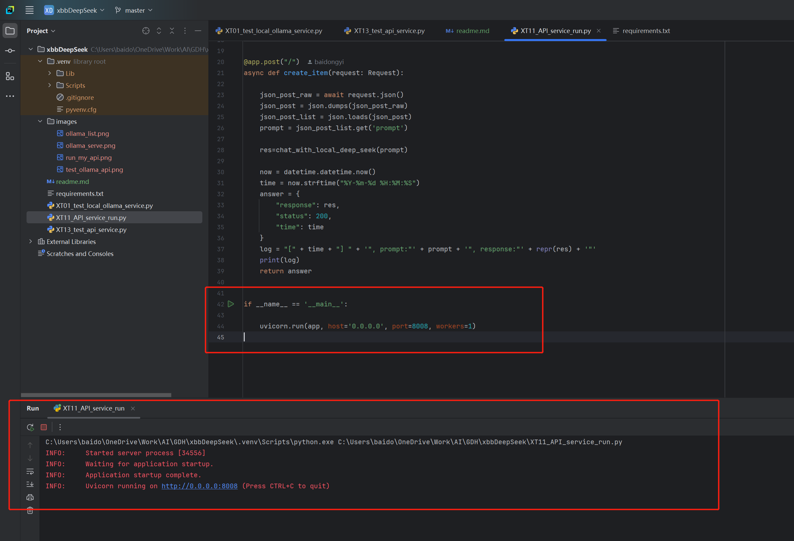
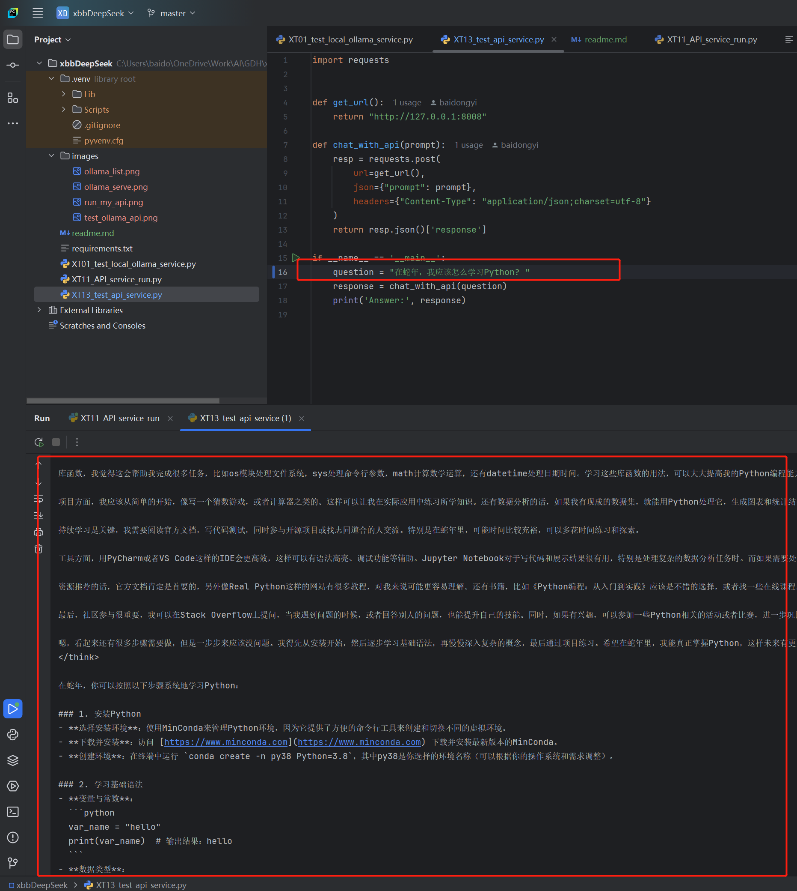
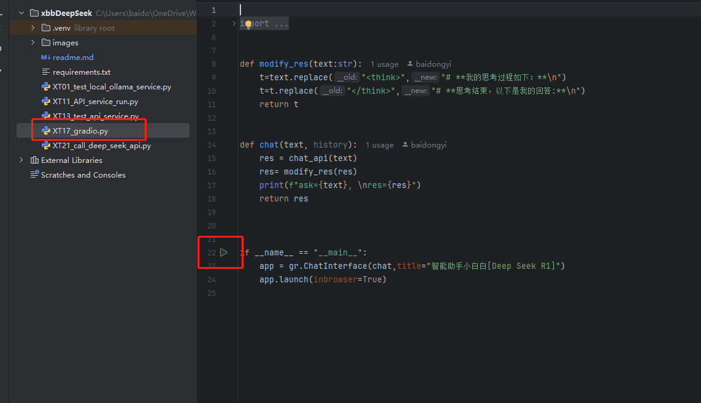
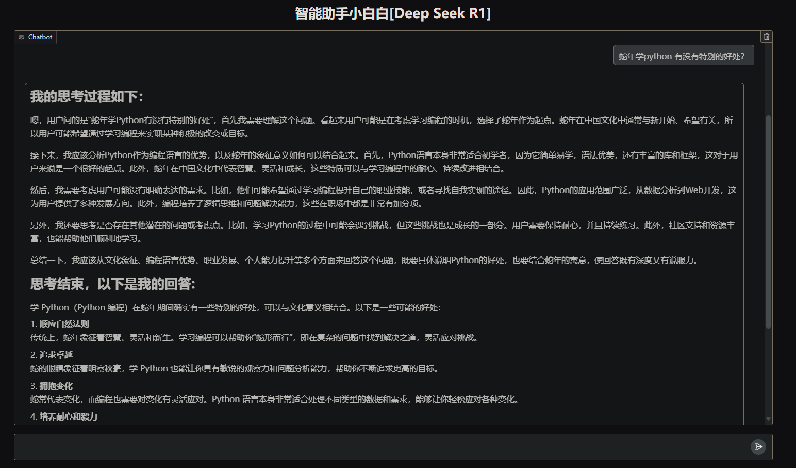

# ***DeepSeek 本地服务部署***

## 1. 硬件要求 ##
要求独显 要用 英伟达 3070 以上显卡。
没有的话，据说CPU+内存可以跑，但是很吃内存、很慢。

## 2. 软件要求 ##
可采用windows. 理论上 Linux, MacOS 都支持，但我主要在windows上开发运行。

## 3. 使用说明 ##

### 3.0 安装本地 deekseek

#### 3.0.1 安装ollama

网络环境支持的，可以在官方下载ollama客户端

[ollma官方下载地址](https://ollama.com/download/windows)

如果网络受限的，可以在我的百度盘下载(windows版本)

[百度网盘下载地址](https://pan.baidu.com/s/1ZLGPGhywIM10Eu93wclH_w?pwd=b3h4)

### 3.0.2 下载或者复制本地模型文件

复制模型文件到 C:/User/当前用户名/ 下

通过百度网盘下载
[百度网盘下载地址](https://pan.baidu.com/s/1SxvCtL_B8zJYdg-nCqYccA?pwd=u65e)

### 3.1 启动ollama本地服务 ###

确认本地模型已经安装好

`ollama list`

Ollama自带本地服务的API，使用以下命令启动这个API服务

`ollama serve`

### 3.2 使用我的脚本验证启动成功 ###

安装Python依赖

`pip install -r ./requirements.txt`

### 3.3 使用python把这个服务以API形式提供出来
这个形式我参考了chatGLM API的脚本

### 3.4 验证测试我提供的API服务

### 3.5 使用Gradio构建图形用户界面

运行我的例子:

进行问答:

